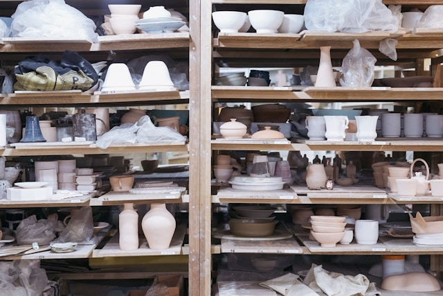

# one-thousand-pots

[todo: add a relevant pottery picture to each sub project README.MD page]
/pots : folder containing each tiny-project

## intro
`focus on quantity over quality`

## index

### 000 - make
based on : 
### 001 - Text Adventure in C
### 002 - Text editor in C (kilo)
### 003 - Nand to Tetris (with a twist)
### 004 - Chip-8 
(again) but with a GUI this time
### 005 - 
